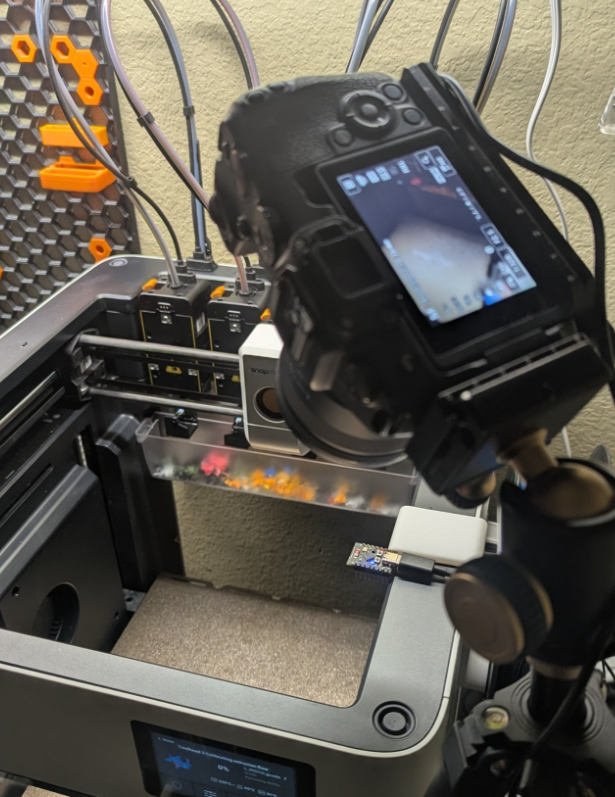

# Snapmaker Canon BLE Timelapse

ESP32-C3 Bluetooth shutter controller for Canon EOS cameras, built for Snapmaker + Klipper timelapse workflows.

The ESP32 connects over USB to your Klipper host. A Python monitor listens to Moonraker events, detects layer-photo markers, and sends trigger commands to the ESP32 over serial. The ESP32 then triggers your Canon camera over BLE.

Basically: the Python script monitors Moonraker for G-code events and triggers the camera through the ESP32 Bluetooth remote.

## ⚠️ Important Disclaimer

- This project is still in active development.
- Current implementation is script-based (host-side Python monitor) and is not a fully native firmware integration.
- Tested on limited hardware combinations; compatibility may vary by printer, firmware, slicer profile, and camera model.
- Not guaranteed production-ready for every setup.
- Use at your own risk: always validate with short test prints before running long jobs.
- Community testing and feedback are highly appreciated, especially from Snapmaker U1 users.

## Example Results: AFTER_LAYER_CHANGE.gcode

Source file: `examples/gcode/AFTER_LAYER_CHANGE.gcode`


Pros:
- Floating tool head with less movement in the pictures

Cons:
- Adds extra toolhead movements and print time

## Example Results: Filament Change G-code Trigger

Source file: `examples/gcode/changefilament.gcode`


Pros:
- Faster trigger flow
- Does not require a separate park command

Cons:
- Can create extra frames if filament changes happen multiple times per layer
- Can miss layers if there are no filament-change events

## Sample Setup



## Project Structure

- `src/`, `include/` - ESP32 firmware source
- `scripts/host/` - host-side monitor/listener/restart scripts
- `examples/gcode/` - example trigger G-code snippets
- `klipper/` - Klipper macro examples (`timelapse_macros.cfg`)
- `docs/` - user/developer documentation and media

## Features

- Bluetooth camera control for Canon EOS over BLE
- Python-based monitor for Moonraker/Klipper print events
- Serial trigger bridge from host to ESP32 (`/dev/ttyACM*`)
- Works with Snapmaker U1 and other Klipper-based printers
- Orca-focused marker support (Snapmaker Orca and OrcaSlicer)
- Optional ESP32 web UI for manual trigger and connection checks

## Hardware Requirements

- **ESP32-C3 DevKit** - BLE camera trigger device
  - Example board: https://amzn.to/4l1zeoW
- **Canon EOS camera** with Bluetooth (tested: EOS RP, R5, R6)
- **Klipper + Moonraker host** - Raspberry Pi or similar
- **USB cable** - Connect ESP32 to host (typically `/dev/ttyACM0`)

## Important Prerequisite (Snapmaker U1)

- You must have **root SSH access** (or equivalent admin access) on the printer host to install and run monitor scripts.
- For **Snapmaker U1**, this usually means running custom firmware that enables root access.
- Recommended project: https://github.com/paxx12/SnapmakerU1-Extended-Firmware

## Supported Slicers

- Snapmaker Orca
- OrcaSlicer

## Compatibility Snapshot

| Component | Status |
|---|---|
| Canon EOS RP | Tested |
| Canon EOS R5 / R6 | Basic trigger flow tested |
| Snapmaker U1 + Klipper/Moonraker | Tested |
| Other BLE camera brands | Planned / not supported yet |

## Known Limits

- Canon BLE support is the current focus (other BLE camera brands are not implemented yet)
- Trigger pipeline currently relies on host-side monitoring scripts
- Root SSH/admin access on the printer host is required for script/service installation
- Filament-change-trigger strategy can over/under-sample layers depending on print behavior

## Quick Start

### 1. Flash ESP32 Firmware & Connect to Klipper Host
```bash
git clone https://github.com/yourusername/snapmaker-canonble-timelapse.git
cd snapmaker-canonble-timelapse
pio run --target upload
```
Then connect the ESP32 to your Klipper host via USB. It should appear as `/dev/ttyACM0` (or another `/dev/ttyACM*` device).

### 2. Pair Canon Camera via Bluetooth
1. Turn on your Canon camera (e.g., EOS RP)
2. Go to **Menu → Bluetooth Settings → Bluetooth Function → ON**
3. Go to **Menu → Bluetooth Settings → Pairing → New Device**
4. Select **"ESP32-Camera-Remote"** from the list
5. Confirm pairing on camera
6. Device should show ✓ Connected

### 3. Install Python Monitor on Klipper Host
```bash
# SSH into your printer (Raspberry Pi running Klipper)
ssh pi@printer_ip

# Clone repo and run install script
cd /tmp
git clone https://github.com/yourusername/snapmaker-canonble-timelapse.git
cd snapmaker-canonble-timelapse
sudo ./install_timelapse_monitor.sh

# Start the service
sudo systemctl start timelapse_monitor
```

### 4. Add Layer Change Command to Slicer
- Add a layer marker in your slicer output (example):
  ```gcode
  ;LAYER_CHANGE
  ```
- See [GCODE_CONFIG.md](docs/GCODE_CONFIG.md) for slicer-specific setup details.

### 5. Start Your Print!
- The Python monitor watches Moonraker output for layer-photo markers
- On match, it sends `trigger` over USB serial to the ESP32
- The ESP32 sends the BLE shutter command to the Canon camera

## Testing Without Web UI (Recommended)

You do not need to access the ESP32 web interface for normal validation.

### Manual trigger from host

```bash
echo "trigger" > /dev/ttyACM0
```

### Watch ESP32 serial logs

```bash
pio device monitor
```

This is a valid headless test path and matches the host-script workflow used by this project.

## Architecture

```
3D Printer → Klipper/Moonraker (on Raspberry Pi)
                      ↓ monitors G-code via WebSocket
                Python Script
                      ↓ writes "trigger" to /dev/ttyACM0
                   ESP32-C3 (connected via USB)
                      ↓ sends BLE command
                  Canon Camera
```

The Python monitor subscribes to Moonraker WebSocket events, detects configured markers, and writes `trigger` to the ESP32 serial device. The ESP32 acts as a dedicated BLE remote for the camera shutter.

## Configuration

### ESP32 (Optional)
Access web interface at **http://192.168.4.1**:
- Optional manual camera trigger
- Optional connection/status checks
- Optional stabilization tuning

### Python Script
Edit `/opt/timelapse_monitor/timelapse_monitor.py`:
- Set Moonraker WebSocket URL
- Configure layer detection patterns (Orca / Snapmaker Orca)
- Adjust trigger timing

See [INSTALLATION.md](INSTALLATION.md) for detailed configuration options.

## Documentation

- **[📦 Installation Guide](INSTALLATION.md)** - Complete step-by-step setup
- **[📷 Camera Pairing](docs/CAMERA_PAIRING.md)** - Pair your Canon camera via Bluetooth
- **[⚙️ G-code Configuration](docs/GCODE_CONFIG.md)** - Configure your 3D printer slicer
- **[🔧 Development Guide](docs/DEVELOPMENT.md)** - For developers and contributors
- **[🔌 Hardware Wiring](WIRING.md)** - USB-C host connection (no GPIO required)
- **[📋 Advanced Setup](SETUP.md)** - Deeper configuration and troubleshooting reference

## Quick Troubleshooting

| Problem | Solution |
|---------|----------|
| **WiFi AP not visible** | Check serial monitor for boot errors |
| **Camera won't pair** | See [Camera Pairing Guide](docs/CAMERA_PAIRING.md) |
| **Photos not triggering** | Verify marker output in print console and monitor config |
| **USB serial not working** | Rebuild firmware with `pio run --target upload` |

See [INSTALLATION.md](INSTALLATION.md) for complete troubleshooting guide.

## Support

- 📖 Check the documentation links above
- 🐛 [Report issues](issues) on GitHub
- 💬 Discussions in project repository

## License

MIT License - See [LICENSE](LICENSE) file for details
